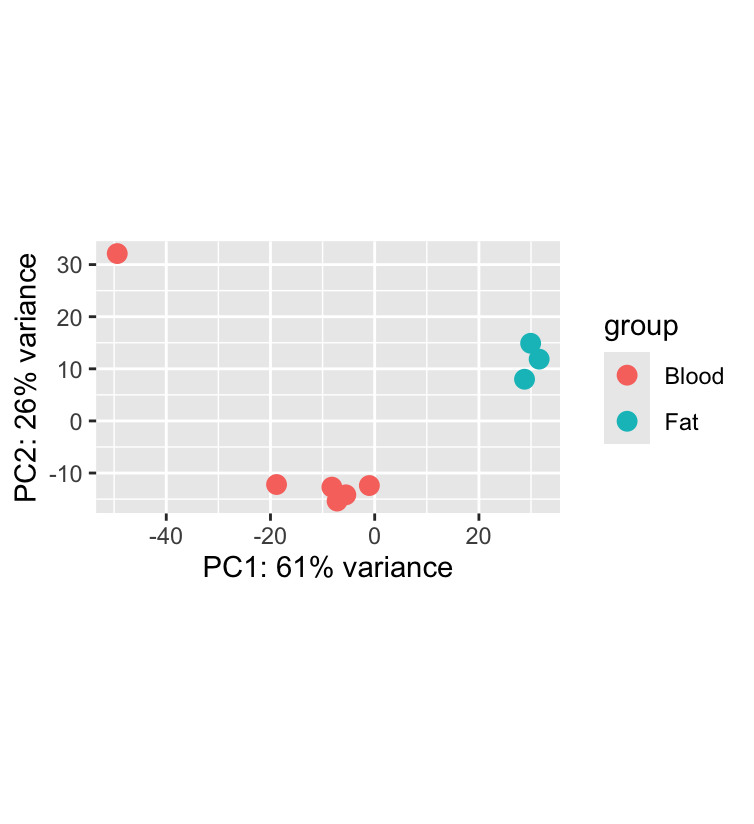
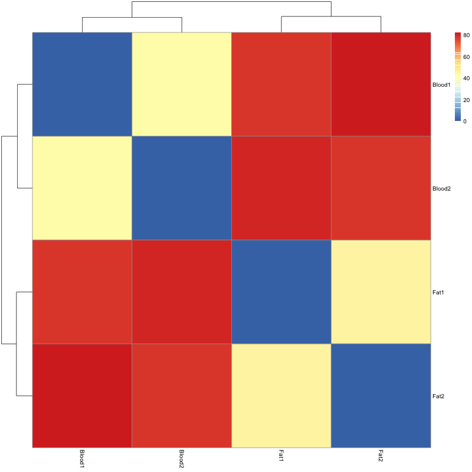
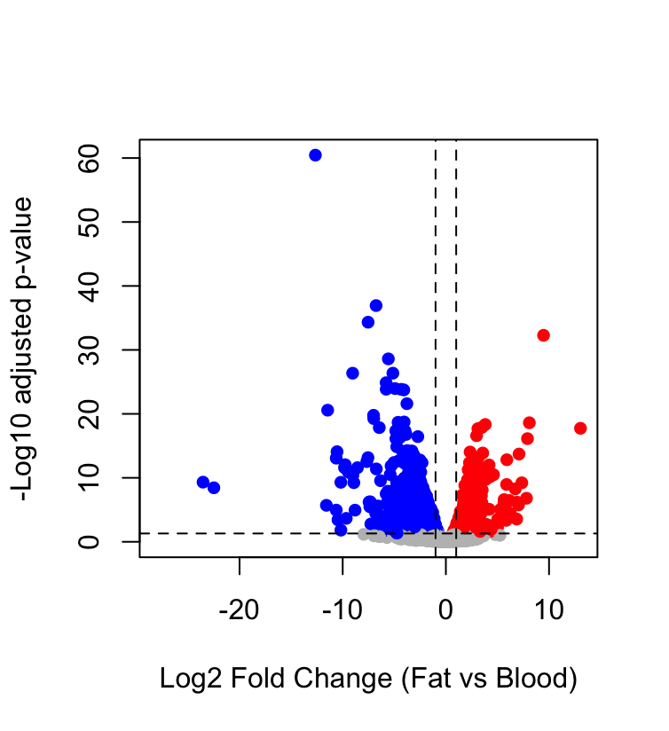
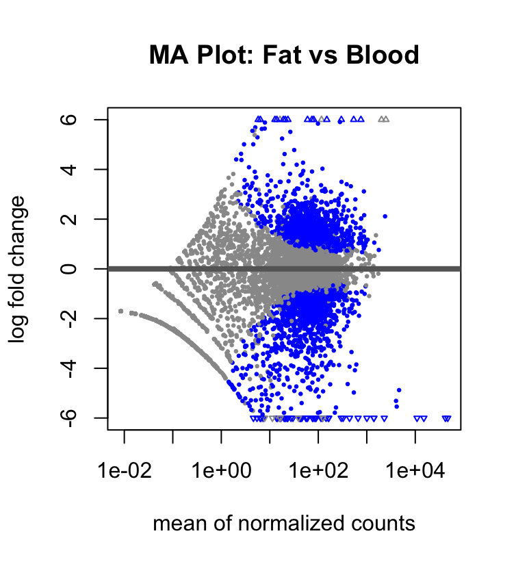
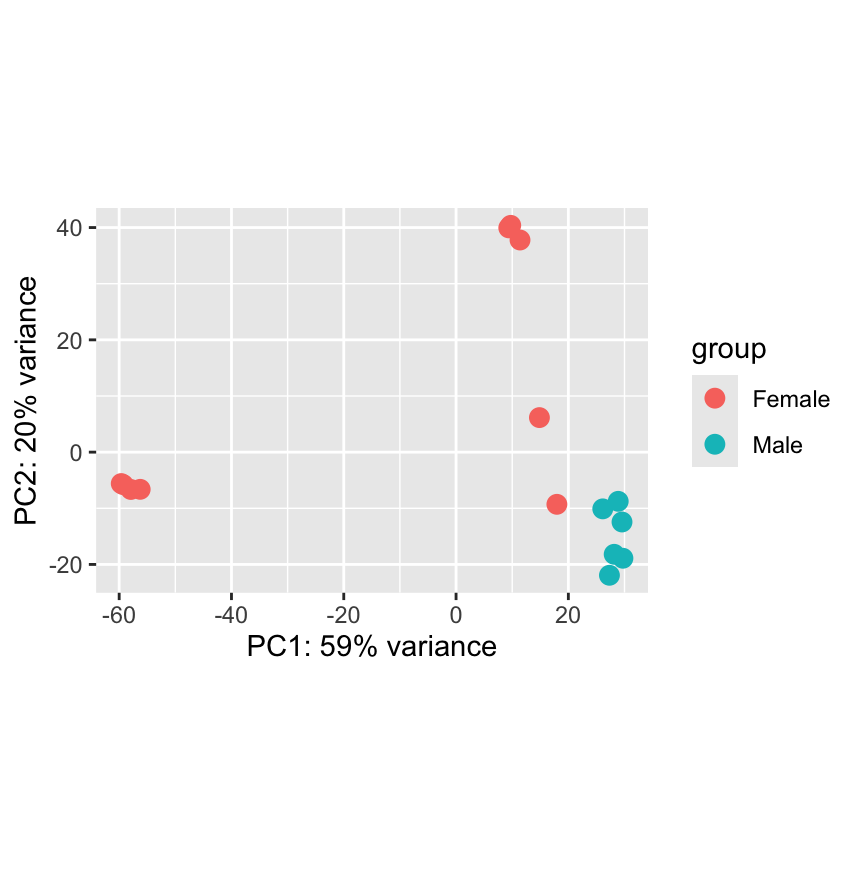
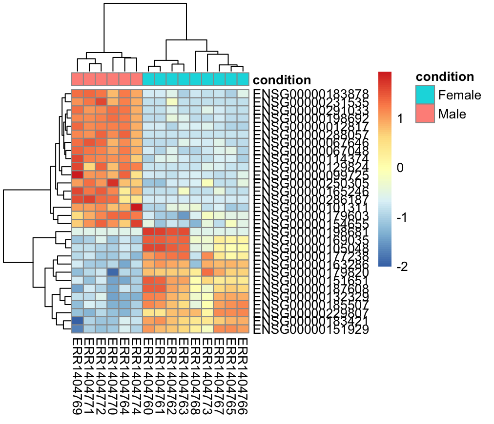
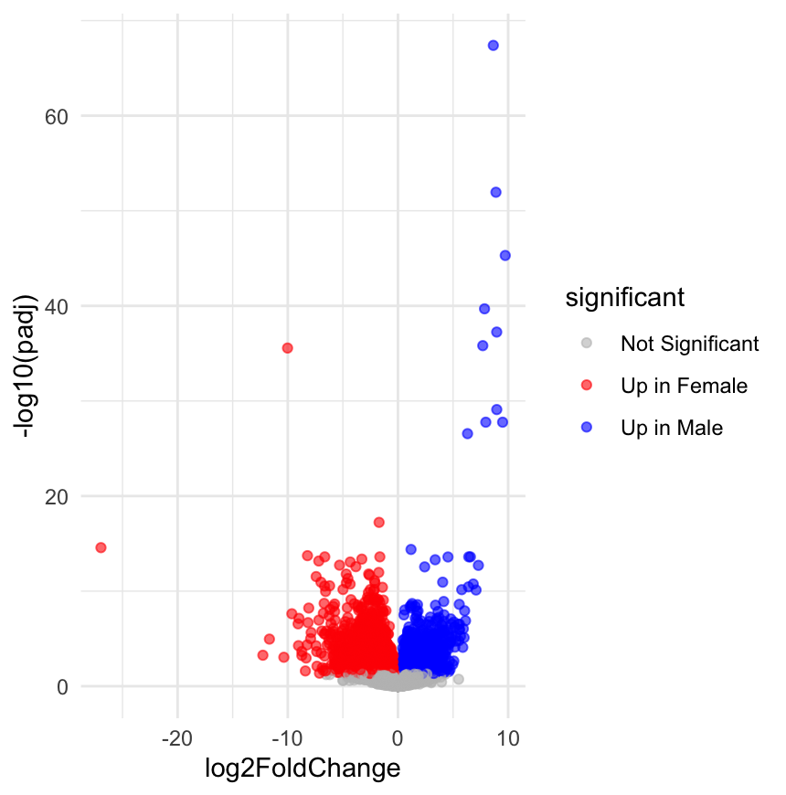
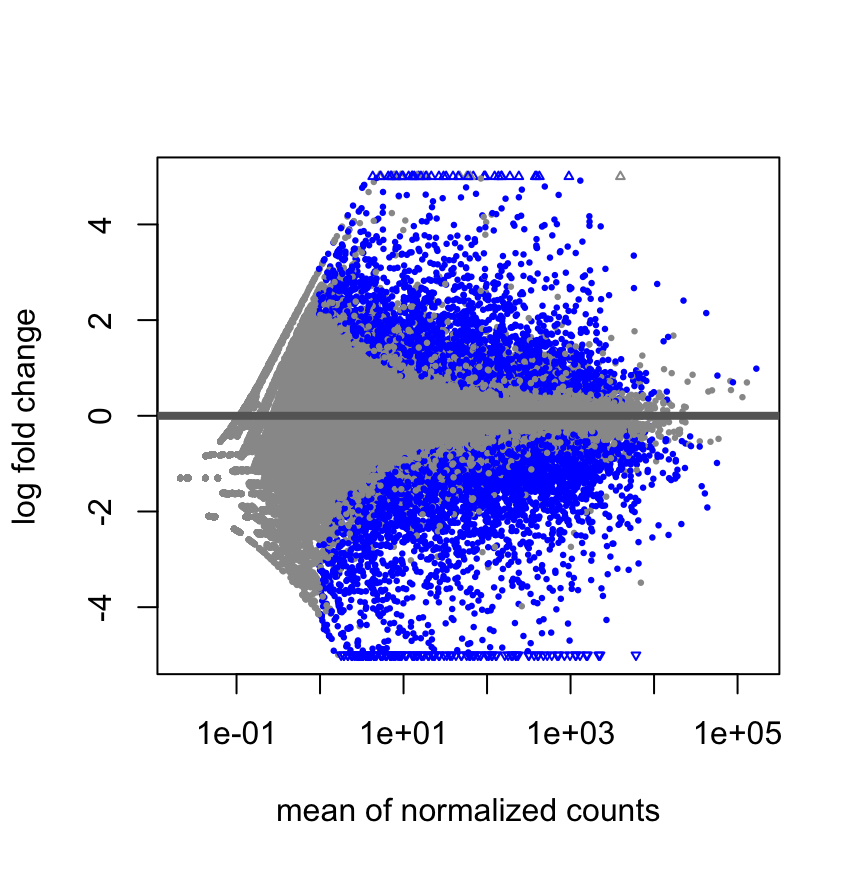
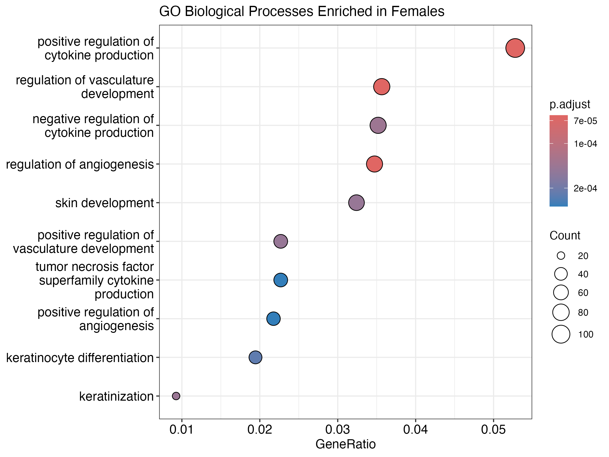
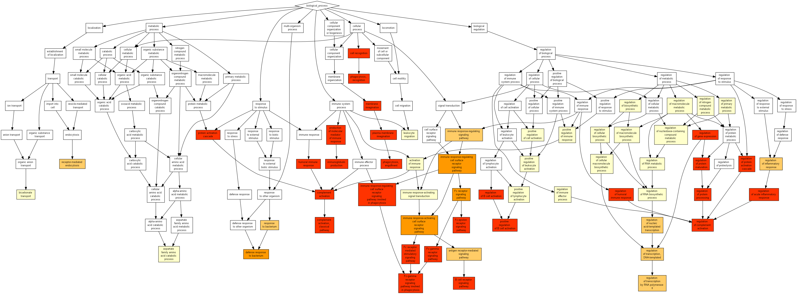

#  RNA-Seq Analysis – Rotation 2  Group 3
**Comparative Transcriptomics in Trypanosoma brucei and Human Cancer**

---

##  Introduction

RNA sequencing (RNA-seq) is a powerful technique used to quantify gene expression across the transcriptome. By mapping sequencing reads to a reference genome, it is possible to identify differences in gene expression between biological conditions.

This project investigates transcriptomic differences in both a parasitic organism (*Trypanosoma brucei*) and human cancer samples.

---

##  Objectives

### Trypanosoma brucei
- Compare gene expression between Blood and Fat samples  
- Identify differentially expressed genes  
- Investigate adaptation to different host environments  

### Human Lung Adenocarcinoma
- Compare gene expression between Male and Female samples  
- Identify sex-specific transcriptional differences  
- Perform Gene Ontology (GO) enrichment analysis  
- Interpret biological pathways  

---

#  PART 1 — Trypanosoma brucei (Blood vs Fat)

##  Methods

- Raw RNA-seq reads were quality checked using **FastQC**  
- Reads were trimmed using **Trim Galore** to remove adapters and low-quality bases  
- Reads were aligned to the *T. brucei* reference genome using **Bowtie2 / STAR**  
- Alignment files were processed using **SAMtools** (sorting and indexing)  
- Gene-level counts were generated using **HTSeq-count**  
- Differential expression analysis was performed using **DESeq2**  

---

##  Results

- ~11,764 genes analysed  
- **2,316 significantly differentially expressed genes**  
- 1,533 upregulated in Fat  
- 1,324 downregulated in Fat  

---

##  Data Visualisation
### PCA

- PC1 explains 61% variance  
- Strong separation between Blood and Fat  
- One potential outlier (Blood6)

---

### Sample Distance Heatmap

- Clear clustering by condition  
- High consistency within Fat samples  

---

### Volcano Plot

- Clear separation of up/downregulated genes  
- Strong biological signal  

---

### MA Plot

- Most genes centered around log2FC = 0  
- Significant genes highlighted  

---

## Biological Insights

- Strong transcriptomic differences between Blood and Fat environments  
- Fat samples show consistent clustering  
- Trypanosomes exhibit:
  - Polycistronic transcription  
  - Directional gene organisation  
  - Post-transcriptional regulation  

---

#  PART 2 — Human RNA-Seq (Male vs Female)

##  Methods

- RNA-seq reads were aligned to the human reference genome (GRCh38) using **STAR**  
- Gene counts were generated directly during alignment  
- A count matrix was constructed for all samples  
- Differential expression analysis was performed using **DESeq2**  
- Gene annotation was performed using **org.Hs.eg.db**  
- Gene Ontology enrichment analysis was conducted using **clusterProfiler**  
- Results were validated using **GOrilla**  

---

##  Results

- ~62,754 genes analysed  
- **5,627 significantly different genes (FDR < 0.05)**  

### Upregulated:
- Male: ~2,503 genes  
- Female: ~3,124 genes  

---

##  Data Visualisation

### PCA

- PC1 explains 59% variance  
- Clear separation between sexes  
- Sex is dominant transcriptional factor  

---

### Heatmap (Top 30 Genes)

- Strong clustering by sex  
- Confirms DESeq2 results  

---

### Volcano Plot

- Balanced upregulation in both sexes  
- Strong statistical significance  

---

### MA Plot

- Symmetrical distribution  
- Strong differential signal  

---

##  Key Biological Findings

### Chromosomal Signals

- Male-upregulated genes include:
  - KDM5D, DDX3Y, UTY, EIF1AY, RPS4Y1  
- Female-upregulated gene:
  - XIST  

---

##  GO Enrichment Analysis

### Male-Upregulated Genes

Enriched processes:
- Immunoglobulin-mediated immune response  
- B cell activation  
- Complement activation  
- Immune signaling pathways  

---

### Female-Upregulated Genes

Enriched processes:
- Angiogenesis  
- Vasculature development  
- Cytokine regulation  
- Keratinization  

---

### GO DAG (GOrilla)

- Strong clustering of immune-related pathways  
- Confirms enrichment analysis  

---

##  Biological Interpretation

- Male tumours show enhanced immune-related activity  
- Female tumours show enhanced angiogenesis and cytokine regulation  
- Sex is a major driver of transcriptomic variation  

---

#  Repository Structure

├── data/
├── scripts/
├── results/
├── figures/
└── README.md

---

## Conclusion

This project demonstrates two comprehensive RNA-Seq workflows and highlights biologically meaningful differences in gene expression across different conditions and systems. These findings highlight the importance of transcriptomic analysis in understanding biological variation across species and conditions.

---

## Tools Used

- FastQC  
- Trim Galore  
- Bowtie2 / STAR  
- SAMtools  
- HTSeq  
- R (DESeq2, pheatmap, clusterProfiler)  
- GOrilla  

---

## Authors

Sahar Naeemi mbxsn4@nottingham.ac.uk

Christopher Janschke mbxcj2@nottingham.ac.uk

Mengchan Liu alyml51@nottingham.ac.uk

MSc Bioinformatics – University of Nottingham  
